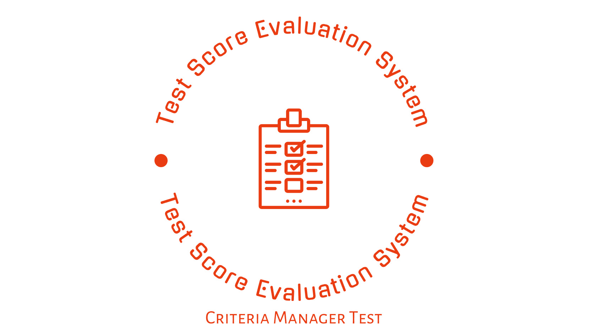

<p align="center"><a href="https://laravel.com" target="_blank"></a></p>

<p align="center">
<a href="https://github.com/laravel/framework/actions"></a>
<a href="https://packagist.org/packages/laravel/framework"></a>
<a href="https://packagist.org/packages/laravel/framework"></a>
<a href="https://packagist.org/packages/laravel/framework"></a>
</p>

# Test Score Evaluation System (FullStack[laravel,inertiajs,Vuexy])



### About project 

- ***This application is committed to the creation of a comprehensive framework planned to oversee and assess test scores successfully.***

### The framework is organized around two essential parts, each with one of a kind authorizations:

### 1.Administrator:

The director part is allowed full control over the framework, including the capacity to execute Make, Studied, Upgrade, and Erase (CRUD) operations for both directors and tests.

### 2.Manager:

People within the director part have the specialist to dole out scores to the tests they are mindful for.


### At the heart of this framework lies the "Test record" substance, characterized by the taking after traits:

- Full name of the test taker
- Date of the test
- Location where the test was conducted
- Score accomplished within the test
- Criteria decided by the score
- Manager responsible for the test

The framework consolidates a table that builds up a relationship between scores and criteria. For occurrence, a score of 60 compares to a measure of 100, whereas a score of 80 compares to a model of 200, and so forward.

<table><tbody><tr><td colspan="1" rowspan="1"><p><span>Оценка</span></p></td><td colspan="1" rowspan="1"><p><span>The table map scores to criteria</span></p></td></tr><tr><td colspan="1" rowspan="1"><p><span>60</span></p></td><td colspan="1" rowspan="1"><p><span>100</span></p></td></tr><tr><td colspan="1" rowspan="1"><p><span>80</span></p></td><td colspan="1" rowspan="1"><p><span>200</span></p></td></tr><tr><td colspan="1" rowspan="1"><p><span>91</span></p></td><td colspan="1" rowspan="1"><p><span>300</span></p></td></tr><tr><td colspan="1" rowspan="1"><p><span>100</span></p></td><td colspan="1" rowspan="1"><p><span>500</span></p></td></tr></tbody></table>

To guarantee consistency and precision in calculations, both the backend and frontend components of the framework are outlined to calculate criteria based on test scores. This include is necessarily to protecting the astuteness of the test assessment handle.

## Requirements

-   PHP = ^8.2
-   Laravel Framework = ^10.*
-   MySql = ^8.0

## Installation:

```sh
composer i
# Optional
npm i

```

- .env:

```ini
# copy .env.example -> .env 
# Replace by yours
APP_URL=[HOST_URL]
DB_DATABASE=[DATABASE_URL]

```
- generate key:

```sh
php artisan key:generate --force
```

- migrate with demo datas:

```sh
php artisan migrate:fresh --seed
```
# and Welcome Aboard!
